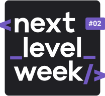

  

<h4 align="center"> 
  🚀 Application developed during the Next Level Week by Rocketseat 🚀
</h4>

  	
  
	
  
  
  
  
  
  
   

  <a href="#-project">Project</a>&nbsp;&nbsp;&nbsp;|&nbsp;&nbsp;&nbsp;
  <a href="#rocket-Technologies">Technologies</a>&nbsp;&nbsp;&nbsp;|&nbsp;&nbsp;&nbsp;
  <a href="#-layout">Layout</a>&nbsp;&nbsp;&nbsp;|&nbsp;&nbsp;&nbsp;
  <a href="#memo-license">License</a>

---

&nbsp;

## 💻 Project

<h1 align="center">
    
</h1>

Proffy is an application that can connect who wants to learn, with wants to teach.

&nbsp;

---

&nbsp;

## 🔖 Layout

Para acessar o layout utilize a ferramenta [Figma](https://www.figma.com/file/PTjyqNvmjKe7DerxPLugXc/Proffy-Web?node-id=0%3A1).

---

&nbsp;

## :rocket: Technologies

This project was developed with the following technologies:

- HTML
- CSS
- Javascript
- Typescript
- [React](https://reactjs.org)
- [React Router-dom](#)
- [Node.js](https://nodejs.org/en/)
- [yarn](#)
- [npm](#)

---

## :memo: License

This project is under the MIT license. See the [LICENSE](LICENSE) for details.